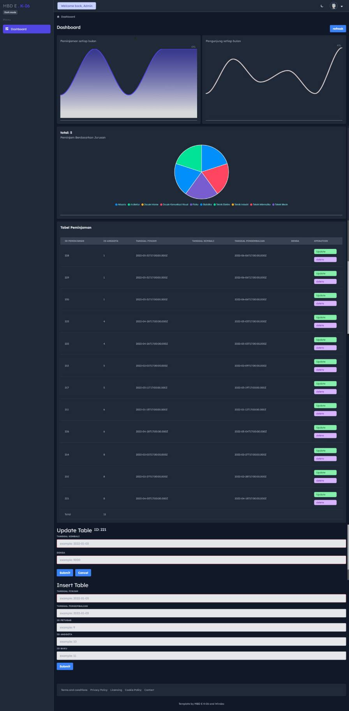

## Configuration Environment

### Server

file locate in `./server/.env` . here is the example configuration for server

```bash
# SERVER
PORT=3030

# DATABASE
PGUSER=postgres
PGHOST=localhost
PGPASSWORD=postgres
PGDATABASE=postgres
PGPORT=5434
```

### User Interface

example configuration for user interface. file locate in `.env`

```bash
VUE_APP_TARGET_SERVER=http://localhost:3030
```

## how to prepare the env

copy env like the previous section and run these commands. after your setup finish, the program ready to run.

```
make startdb
make init
```

> you should have installed docker and docker compose on your PC

## how to run

run those both commands on different terminals

### user interface

`npm run serve`

> in some cases, need to install or run using `yarn`

### server

```
cd server
npm run server
```

## how to build

`npm run build`

## SQL query

you can check SQL QUERY on `./query.sql`

## Link Demonstration

link demo was [here](https://drive.google.com/file/d/1NANHuUZMP6TacieMFzAPw7lgQJ3Ez9PX/view?usp=sharing)

## Website Views



> API List

```json
pengunjungBulanan: {
  bulan: number,
  banyak: string
}
```

```json
peminjam_jurusan: {
  jurusan: string,
  jumlah_peminjam: int
}
```

```json
peminjaman_setiap_bulan: {
  bulan: string,
  coalesce: int
}
```

```json
tabel_peminjaman: {
  denda: int,
  id_anggota: int,
  id_buku: int,
  id_peminjaman: int,
  id_petugas: int,
  tanggal_kembali: timestamp,
  tanggal_pengembalian: timestamp,
  tanggal_pinjam: timestamp
}
```

Big thanks to @sahrullahh has provided starter project i used on current project

[Windzo starter project](https://github.com/sahrullahh/windzo)
